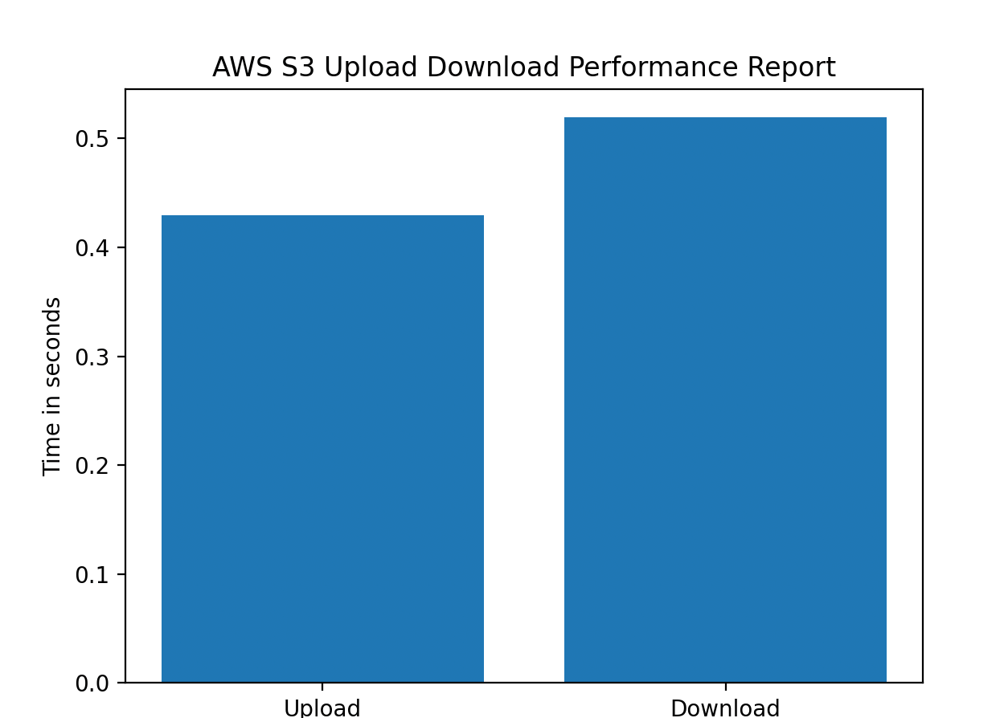

# Steps to execute the testcase

1. Clone the repo
2. Execute following commands
   ```commandline
     pip install -r requirements.txt
    ```
3. Go to test dir 
   ```commandline
    cd tests
    pytest -s 
   ```
   After running the first testcase a report will be generated. 
  

# Dir structure. 
   pytest framework is used to achieve the same.

[libs](libs) -- Contains helper libraries those are needed. 

[config](config) -- Config params such are locators, constants.

[tests](tests) --  Contains actual testcases. 


# Problem Statement
   
   Test 1 - aws s3

      1. Create a aws s3 bucket
      2. Upload a text file
      3. Download the text file
      4. Delete the text file
      5. Prepare a report for file upload performance, data visulization methods are preferred

   Test 2 - MEGA desktop App

      Go to page https://mega.nz/desktop, select Linux platform, 
      write a script to verify the download links for MEGA Desktop App are working for all linux distributions.
